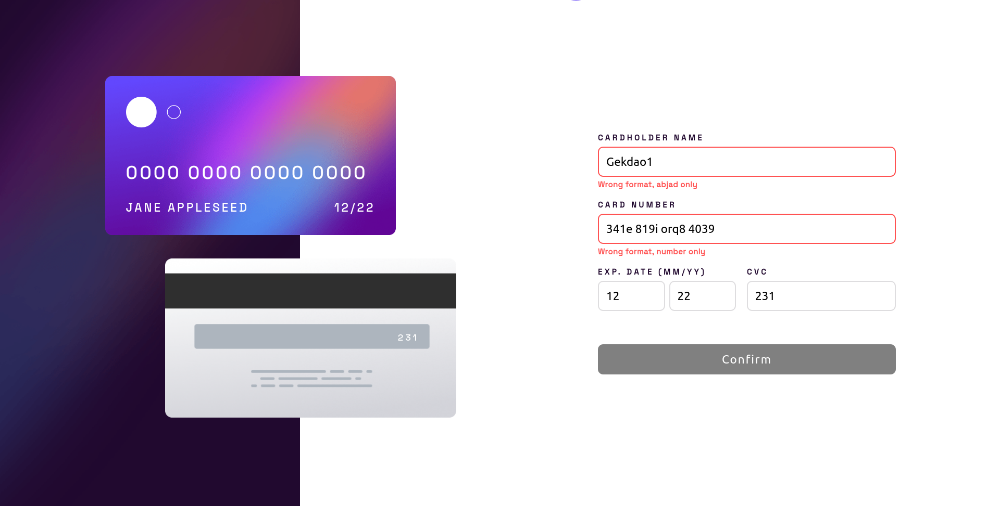
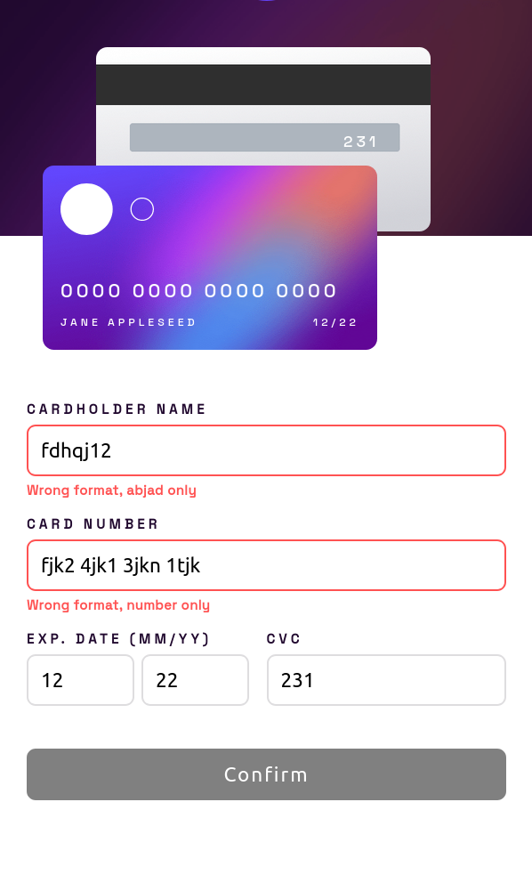

# Frontend Mentor - Interactive card details form solution

This is a solution to the [Interactive card details form challenge on Frontend Mentor](https://www.frontendmentor.io/challenges/interactive-card-details-form-XpS8cKZDWw).

## Table of contents

- [Overview](#overview)
  - [The challenge](#the-challenge)
  - [Screenshot](#screenshot)
  - [Links](#links)
- [Author](#author)

## Overview

### The challenge

Users should be able to:

- Fill in the form and see the card details update in real-time
- Receive error messages when the form is submitted if:
  - Any input field is empty
  - The card number, expiry date, or CVC fields are in the wrong format
- View the optimal layout depending on their device's screen size
- See hover, active, and focus states for interactive elements on the page

### Screenshot

- Desktop Preview Start \
  

- Error Handling \
  

- Mobile Preview \
  

- Success Form \
  

### Links

- Solution URL: [solution](https://github.com/Biggboss7/Credit-Card)
- Live Site URL: [live site](https://fascinating-snickerdoodle-28f248.netlify.app)

## Author
- Github - (https://github.com/Biggboss7/)
